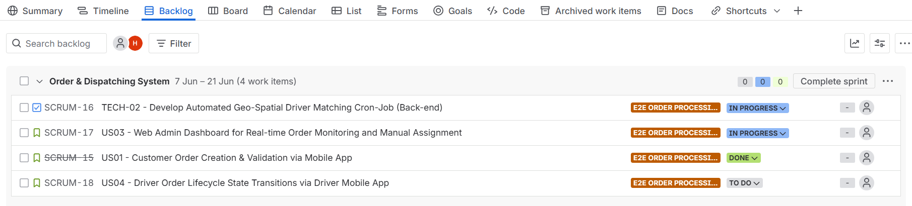
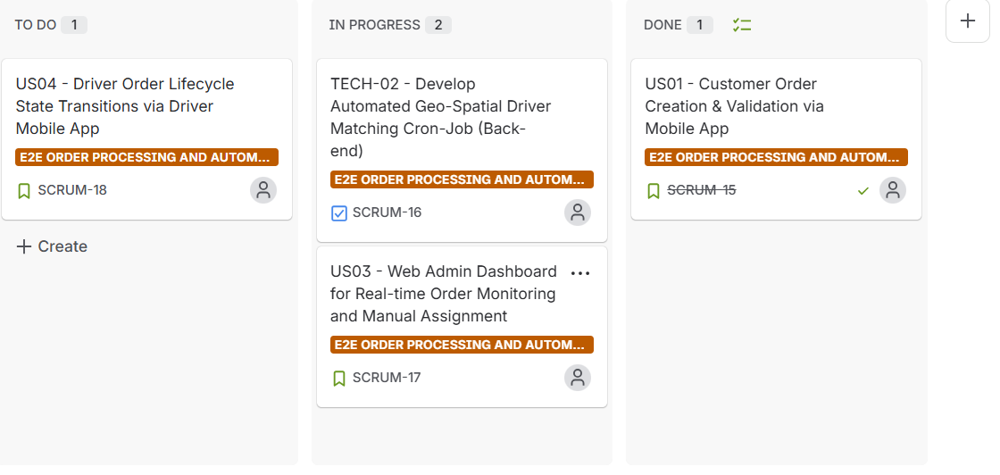

# Food Delivery Order & Logistics Dispatch Engine

## 📌 Project Overview
Designed an end-to-end checkout, coupon validation, and automated driver-dispatch system handling high-volume concurrent orders. This project focuses on system resilience, edge-case handling, and operational efficiency.

## 🛠️ Tech Stack & Tools
- **Project Management:** Jira (Scrum / Agile)
- **Business Analysis:** Use Case Specification, Business Rules, Exception Handling
- **System Mapping:** Mermaid.js (Activity Diagrams)
- **UI/UX Prototyping:** Visily

## 🚀 Key Features & Traceability
- **E2E Checkout Flow:** Automated validation for inventory, coupons, and payment gateways.
- **Resilience Engineering:** Implemented Idempotency Keys (BR-01) for network disconnections to prevent double charges.
- **Automated Dispatching (TECH-02):** Tiered driver-search algorithm expanding from a 3km to 5km radius based on real-time availability.
- **Web Admin Dashboard (US03):** Incident alert cards (P1-HIGH) for operations management to manually intervene when automated dispatch fails.

## 📂 Project Artifacts
- **Detailed Use Case Specification:** [Insert your Notion Link here]
- **Jira Board/Sprint Backlog:** Managed via Agile methodology (SCRUM-15, SCRUM-16, SCRUM-17).
- ## 📋 Agile Project Management (Jira)
To ensure structured execution and traceability, the entire workflow was managed on Jira using Scrum methodology (including tickets SCRUM-15, SCRUM-16, and SCRUM-17).

> 🔗 **Jira Project Link:** [Click here to access My Scrum Space]([(https://vnmhieu080205.atlassian.net/jira/software/projects/SCRUM/boards/1/backlog?atlOrigin=eyJpIjoiZDI5ZmU3OTkzNGFjNGQ1NGFlOTA4MDg4ODZkMWVhYzAiLCJwIjoiaiJ9))  
> *(Note: This is a private corporate/portfolio workspace. If access is restricted, please refer to the visual evidence below).*

### 1. Sprint Backlog & Planning
Organized User Stories and Technical Tasks into a 2-week sprint cycle.

### 2. Kanban Board Tracking
Visualized the development process tracking items from 'To Do' to 'Done'.

